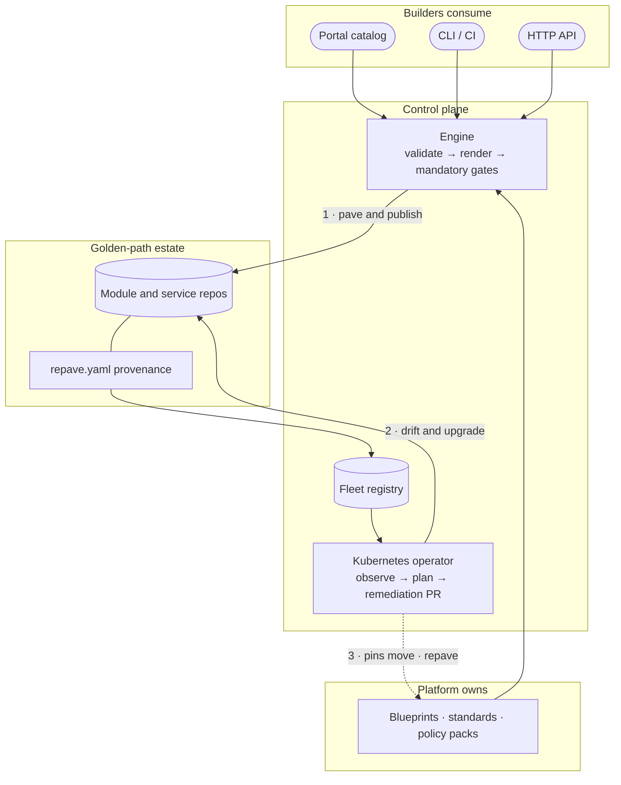
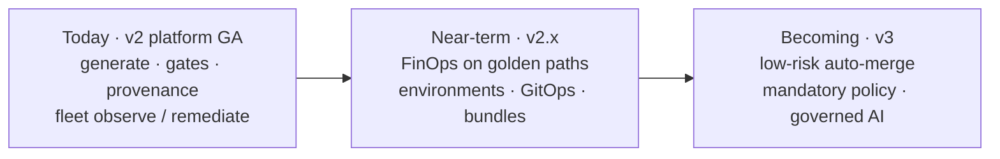
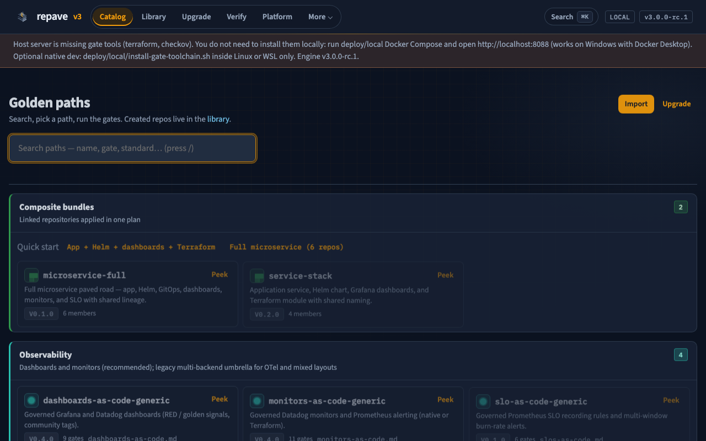
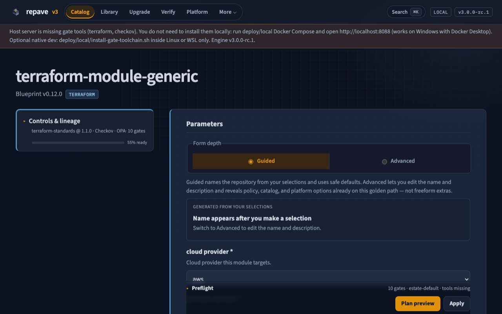
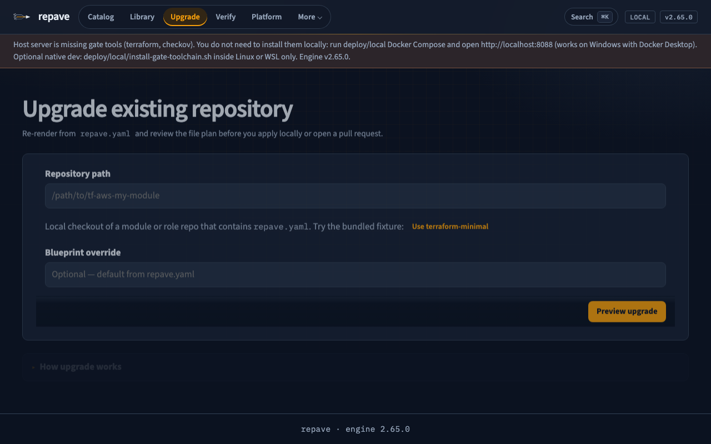
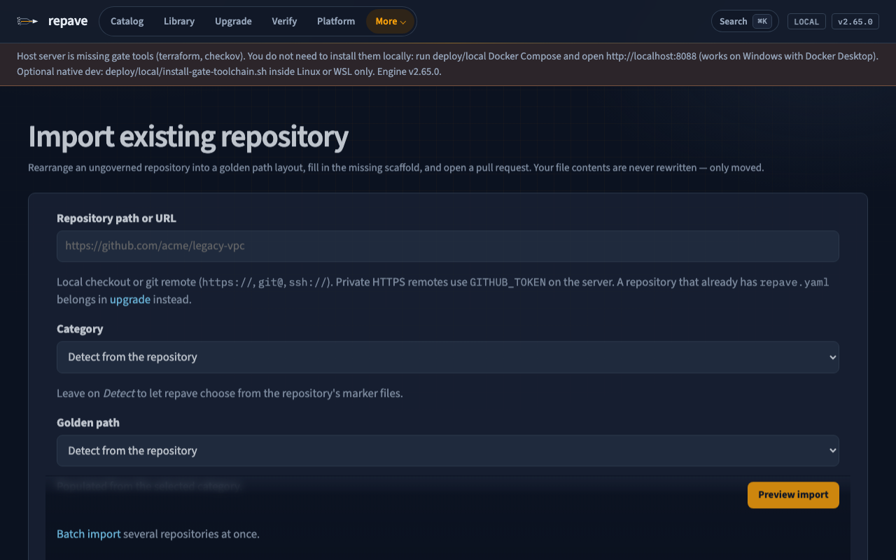
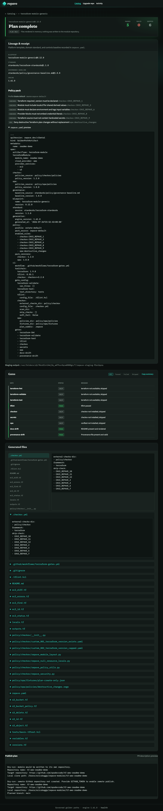
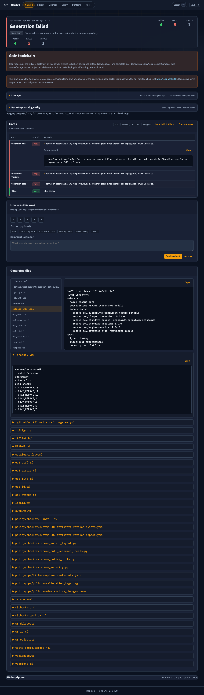
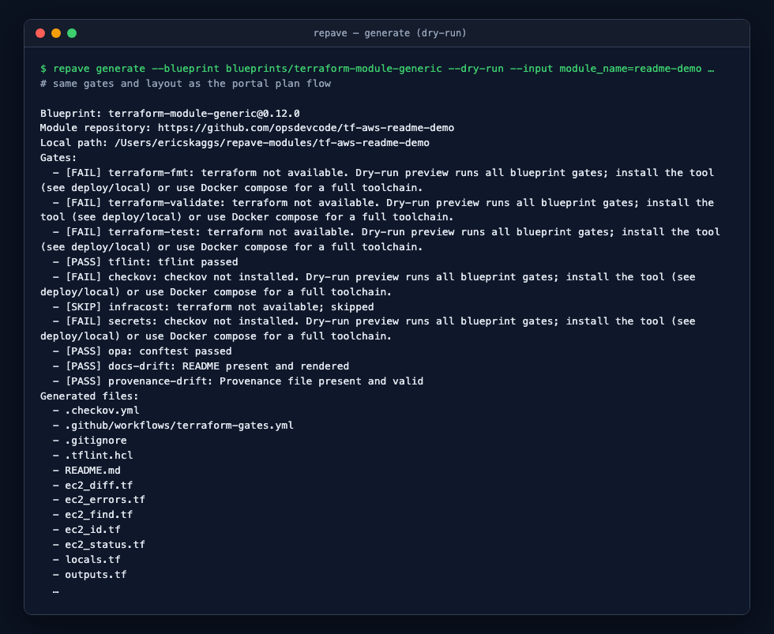
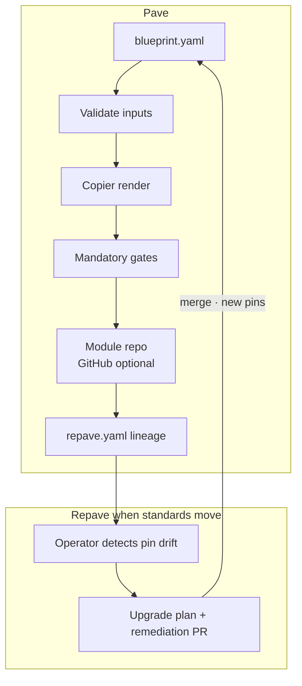

# repave

**Governed golden paths for everyone who builds platform automation.**

## Why "repave"?

Platform teams pave roads: a blessed way to stand up a module, a service, a policy pack. Those
roads crack over time — a standard moves, a provider pin ages, a control changes — and the usual
fix is hand-patching every repo that was built on the old surface.

repave takes the immutable-infrastructure answer instead of the patch-in-place one: artifacts are
**paved** once from a versioned blueprint and **repaved** from that blueprint whenever the standard
moves forward. You never patch a pothole in one repo; you move the road and re-render everything
that rides on it.

Answer a short form (or call the API) and repave renders a **deterministic** artifact from
versioned blueprints, runs **mandatory gates**, and publishes a **module repository on
GitHub** — standards enforced by construction, not review theater.

```text
Pick a golden path  →  Configure pins & scope  →  Generate  →  Gates  →  Publish
```

> **Engine [v2.48.0](https://github.com/opsdevcode/repave/releases/tag/v2.48.0)** · Portal + CLI +
> optional Kubernetes **operator (GA)**. Run locally with Docker Compose — no cluster required
> for generation.

**Try it:** [Quickstart](docs/quickstart.md) → http://localhost:8088

---

## What repave is

repave is an **internal developer platform** for golden-path estates: a control plane where
platform teams own blueprints, standards, and policy packs; builders consume paved roads through
the portal, CLI, or API; and the estate stays aligned via provenance, fleet registry, and the
Kubernetes operator.





| Horizon | What that means |
| --- | --- |
| **Today (v2 platform GA)** | Generate → mandatory gates → provenance → publish; fleet observe / plan / remediate via portal, CLI, API, and operator |
| **Near-term (v2.x)** | FinOps enablement on golden paths (tags → estimates → showback → thin FOCUS); deeper lifecycle surfaces (environments, GitOps, composite bundles) |
| **Becoming (v3)** | Low-risk autonomous remediation, mandatory policy tier, lifecycle control plane, governed conversational AI — humans still own high-risk change |

Product model: [Concepts](docs/concepts.md) · Planning: [Roadmap](docs/roadmap.md) · Cost path: [FinOps](docs/finops.md)

---

## Why teams use repave

- **Many builders, one standard** — Product engineers use the portal; platform keeps blueprints, standards, and policy packs.
- **No bypass** — Every generate runs the blueprint’s gate list before publish.
- **Repeatable** — Copier templates + pinned standards → the same inputs produce the same repo layout.
- **Your standards** — Point blueprints at your `standards/` tree and pin versions in `blueprint.yaml`.
- **Local-first** — Full loop on a laptop: form → dry-run → gates → local git (optional GitHub push).

Deep dive: [Concepts](docs/concepts.md) · [Roadmap](docs/roadmap.md) · [Quickstart](docs/quickstart.md)

---

## Portal (primary UX)

Night-ops web UI at **http://localhost:8088** ([Docker Compose](deploy/local/README.md) — gate
tools in the image; works on Windows with Docker Desktop). Optional **`make serve`** on
`:8089` is for engine/template dev without a full local toolchain.

The portal is the day-to-day IDP surface: catalog by artifact family, governance sidebar,
stepper forms, **Dry run preview** on early steps, gate dashboard on results, and upgrade
preview for existing repos. Screenshots below are captured from a running portal (not
mockups).

<p align="center">
  
  <br />
  <sub>Home — live portal catalog, quick menu, search</sub>
</p>

<table>
  <tr>
    <td width="50%">
      
      <br />
      <sub>Blueprint form — governance rail + delivery stepper</sub>
    </td>
    <td width="50%">
      
      <br />
      <sub>Update repo — plan upgrades from repave.yaml</sub>
    </td>
  </tr>
</table>

<p align="center">
  
  <br />
  <sub>Import repo — adopt an existing repository into a golden path</sub>
</p>

<p align="center">
  
  <br />
  <sub>Plan result — lineage, policy pack, gates (dry-run)</sub>
</p>

<p align="center">
  
  <br />
  <sub>Backstage — <code>catalog-info.yaml</code> + <code>repave.dev/*</code> lineage (optional on form)</sub>
</p>

<p align="center">
  <sub>
    Maintainers — update portal and CLI PNGs:
    <code>./scripts/capture_portal_screenshots.sh</code>
    (<a href="docs/images/README.md">docs/images</a>)
  </sub>
</p>

### CLI (same engine)

Use the portal for discovery; use **`repave generate`** in CI, scripts, and operator
workflows. Dry-run prints the same gate summary and file list without writing a module repo.

<p align="center">
  
  <br />
  <sub><code>repave generate --dry-run</code> — gates + generated paths (see <a href="engine/README.md">engine/README.md</a>)</sub>
</p>

Example:

```bash
cd engine && uv sync --extra dev
export REPAVE_GITHUB_ORG=your-org REPAVE_MODULES_ROOT=$HOME/repave-modules
repave generate --repo-root .. --blueprint blueprints/terraform-module-generic --dry-run \
  --input module_name=example --input description="Example module" \
  --input cloud_provider=aws --input provider_services=ec2,s3
```

---

## What you can do today

The paved-road loop of the IDP — same contracts in portal, CLI, and API:

- **Generate** Terraform, Ansible, policy, observability, Helm, and app-service golden paths ([`blueprints/`](blueprints/)).
- **Portal + API** at `:8088` — forms, `/activity` audit view, [`POST /api/v1/generate`](docs/backstage.md).
- **Import** an existing repository into a golden path layout via a reviewable PR — files move
  byte-identically, scaffold fills the gaps ([`repave import`](docs/import.md)).
- **CLI** — `repave generate`, `repave list`, `repave import` (adopt an existing repo),
  `repave update` (plan/apply blueprint upgrades),
  `repave register` / `repave fleet` ([fleet registry](docs/fleet-registry.md)).
- **Publish** — local git under `REPAVE_MODULES_ROOT` or GitHub with `GITHUB_TOKEN` ([module repos](docs/module-repositories.md)).
- **Operator (GA)** — drift detection, upgrade plans, and remediation PRs ([overview](docs/operator-overview.md) · [GA scope](docs/operator-ga.md))

Gates, schemas, and CI detail: [Engine capabilities](docs/engine-capabilities.md)

---

## Published container images (`ghcr.io/opsdevcode`)

| Package | Role |
| --- | --- |
| [`repave-engine`](deploy/packages/repave-engine/README.md) | Worker + gate toolchain (async runs, `live_plan`) |
| [`repave-engine-portal`](deploy/packages/repave-engine-portal/README.md) | Portal/API only (no gate CLIs) |
| [`repave-corpus`](deploy/packages/repave-corpus/README.md) | Blueprints, standards, policy, schemas (initContainer) |
| [`repave-operator`](deploy/packages/repave-operator/README.md) | Kubernetes drift + remediation PRs |

Built on `main` and semver tags — see [`deploy/packages/`](deploy/packages/README.md) and
[`docs/supply-chain.md`](docs/supply-chain.md). GHCR shows a short description per image from
OCI labels; full docs live in each package README above.

---

## Try it in 60 seconds

```bash
cd deploy/local && docker compose up --build
# or from repo root: make serve  →  http://127.0.0.1:8088
```

Pick **terraform-module-generic**, use **Dry run preview** (or leave plan-only on Delivery), submit —
you get gate results and a file preview without writing to disk.

Full steps (CLI, publish, operator): **[docs/quickstart.md](docs/quickstart.md)**

---

## How it works



```text
blueprint.yaml  →  validate inputs  →  Copier render  →  gates  →  module repo  →  GitHub (optional)
```

Generated modules live in **separate git repos** (`REPAVE_MODULES_ROOT`), never inside
this monorepo. See [Module repositories](docs/module-repositories.md).

Optional **operator** loop (estate scale): [Operator overview](docs/operator-overview.md)

---

## Documentation

| Topic | Doc |
| --- | --- |
| **Index** | [docs/README.md](docs/README.md) |
| Quickstart | [docs/quickstart.md](docs/quickstart.md) |
| Product model (IDP concepts) | [docs/concepts.md](docs/concepts.md) |
| Engine & gates | [docs/engine-capabilities.md](docs/engine-capabilities.md) |
| FinOps enablement | [docs/finops.md](docs/finops.md) |
| Import an existing repo | [docs/import.md](docs/import.md) |
| Portal UX spec | [docs/portal-design.md](docs/portal-design.md) |
| Roadmap | [docs/roadmap.md](docs/roadmap.md) |
| Backstage & HTTP API | [docs/backstage.md](docs/backstage.md) |
| OIDC service mode | [docs/auth-service-mode.md](docs/auth-service-mode.md) |
| Operator | [docs/operator-overview.md](docs/operator-overview.md) |
| Operations (metrics, k8s) | [docs/operations/README.md](docs/operations/README.md) |
| Releases (maintainers) | [docs/releases.md](docs/releases.md) |
| Engine package | [engine/README.md](engine/README.md) |

---

## Repository layout

```text
engine/      Generation engine, portal, CLI, API
blueprints/  Versioned golden paths
standards/   Standards corpus (pinned by blueprints)
policy/      Checkov, OPA, ansible-lint packs
operator/    Kubernetes reconciliation (GA — inventory & upgrade PRs)
deploy/local Docker Compose quickstart
docs/        Product & engineering documentation
schemas/     Frozen JSON contracts
```

---

## Contributing & releases

[CONTRIBUTING.md](CONTRIBUTING.md) — conventional commits, `make quality`, `make test`.

Automated semver and GitHub Releases: [docs/releases.md](docs/releases.md)

---

## License

Apache License 2.0 — see [LICENSE](LICENSE).
