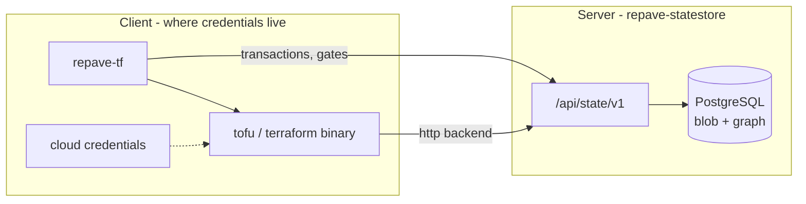

# ADR 004: State custody and the resource graph

**Status:** Accepted — **Phase 0** shipped (binary resolution, migration runner, `repave-cli`
scaffold, frozen `/api/state/v1` contract); **Phase 1** shipped (authoritative store, HTTP
backend, reversible import/export); **Phase 2** shipped (normalization, graph, inventory,
blast radius, drift, timeline, cost join); **Phase 3** shipped (transactions,
commit-time conflict detection, gate-blocked commit, `repave-tf tf plan|apply`).
**Phase 4** not started — **no-go** recorded in
[`docs/state-graph-phase4-review.md`](../state-graph-phase4-review.md) (2026-08-06).
**Date:** 2026-08-04
**Scope:** `engine/src/repave_engine/statestore/`, `engine/src/repave_engine/api_state/`,
new top-level `cli/` package (`repave-cli`), `repave.config.yaml`, Helm chart — v2.x line,
post [contract freeze](../roadmap.md#v200--platform-ga)
**Supersedes:** the "repave becomes a Terraform runner" rejection in
[ADR 003](003-environment-lifecycle-and-live-state.md#alternatives-considered), on the
narrow grounds set out under [Reconciling ADR 003](#reconciling-adr-003).

## Context

Repave governs **artifacts**. The loop is generate → gate → publish → observe pin drift →
open a remediation PR. Terraform is rendered from blueprints, validated by gates, and handed
to someone else to run. Three facts follow, and all three are load-bearing:

- **Repave has never owned state.** [`environment_vend.py`](../../engine/src/repave_engine/environment_vend.py)
  and [`environment_reclaim.py`](../../engine/src/repave_engine/environment_reclaim.py) say so
  explicitly. ADR 003 Phase 3 vends by writing desired state into a GitOps repository
  precisely so that repave never holds apply rights.
- **Plan JSON is deliberately ephemeral.** [`live_plan.py`](../../engine/src/repave_engine/live_plan.py)
  scrubs it after evaluation: *"Plan JSON is ephemeral: summarized for the run result, then
  deleted. It never enters provenance, audit records, or persisted run payloads."*
- **There is no graph.** No `.tfstate` parsing, no DAG, no dependency edges anywhere in the
  repository. "Drift" in repave means *pin* drift — `repave.yaml` provenance against blueprint
  and standard versions — not infrastructure drift.

The consequence is that repave can tell you a repository is conformant and cannot tell you
what it built. Policy runs against repository shape; blast radius is tribal knowledge; the
inventory question ("what do we actually have?") has no answer in the system.

Terraform's own model is the reason. State is a flat JSON document behind a global lock:
every operation reads, locks, and rewrites the whole file. Every capability that teams want
downstream — change correlation, drift, blast radius, inventory, cost attribution, parallel
execution — inherits that limitation. The missing layer is not another tool on top; it is a
data model underneath.

### Constraints

The four constraints from ADR 003 still bind, and a fifth is added by this decision:

1. **Local-first.** The full loop keeps running on a laptop via Compose and `make serve`.
   Everything here is optional and off by default.
2. **No bypass.** Every artifact that reaches a repository passed the blueprint's gates.
3. **A human on every mutation** in the v2 line.
4. **Repave must not become a credential honeypot.** It already holds GitHub write access for
   the whole estate. Adding cloud administrative credentials to the same service multiplies
   blast radius far more than it multiplies capability.
5. **State is tier-0.** If the store is down or corrupt, nobody in the org can plan or apply.
   That is a materially different operational contract than a portal, and it applies from the
   first byte written.

## Decision

Repave becomes the **authoritative store** for Terraform state, normalized into a queryable
resource graph in PostgreSQL, with byte-exact reversible export. Execution stays on the
client. The work is staged so each phase ships value alone, and the highest-risk phase is
gated behind an explicit review.

### The credential boundary is the architecture

The split between service and client is not packaging convenience. It is the mechanism that
preserves constraint 4.

- **The store is a service.** The Terraform `http` backend is a network protocol —
  `GET`/`POST`/`DELETE` on a state document plus `LOCK`/`UNLOCK`. Something must listen.
- **Execution is a client.** `plan` and `apply` run where provider credentials already are:
  the CI runner or the engineer's machine. If the repave *server* drove tofu, repave would
  become custodian of every team's cloud credentials — a larger expansion of blast radius
  than the state store itself.

**Hard boundary:** `repave-cli` never imports `sql_store` or `psycopg` and never holds a
database DSN. It speaks HTTP only. Direct database access from clients would reproduce
exactly the flaw in Terraform's `pg` backend, where every engineer needs database
credentials.

### Phase 0 — Foundations

Binary resolution (`tofu` preferred, `terraform` fallback), a versioned SQL migration runner,
the `cli/` package scaffold, and a frozen `/api/state/v1` contract. PostgreSQL 14+ is
**mandatory** for the state store; SQLite remains supported for the existing runs, audit, and
session path and is accepted for the state store only in local development.

### Phase 1 — Authoritative state store

The `http` backend endpoints, `state_versions` with a byte-exact blob guarded by monotonic
`serial` and matching `lineage`, and whole-state locking with `423`/`409` semantics.

Two rules make everything downstream safe:

- **Keep the original bytes.** Normalization is a derived index, never the source of truth.
  This is what guarantees byte-exact export and makes the escape hatch real.
- **No dual-write.** A file and the database are never co-authoritative.

### Phase 2 — Normalization and the graph

State version 4 parsed into `resources`, `resource_instances`, `attributes`, and `edges`.
Inventory, blast radius, drift, timeline, and cost attribution are queries over that schema,
not separate subsystems. None of it touches the write path.

### Phase 3 — Transactions and commit-time conflict detection

`repave-tf tf plan` / `repave-tf tf apply` drive the binary locally against a server-side
transaction: open, plan, preview, apply, commit, with a bail-out at every step. Gates are
evaluated before commit, so a policy or cost failure **blocks** the transaction rather than
being advisory. This is the capability no external vendor can offer, because it requires
repave's blueprint provenance and gate corpus.

Concurrency is optimistic. Each transaction pins the serial it read and declares the
resources its plan touches; overlap is detected at commit and returns `409` naming the
transactions that got there first. Only write-write overlap conflicts. Holding a lock
across a plan that runs for minutes would be strictly worse than the whole-state lock
Terraform already takes, because it holds longer.

**Where gates actually run, and what that buys.** The client runs them, because the client
holds the working directory and the credentials; it reports results with the preview. The
server enforces `required_gates`: a required gate that is missing, failing, or skipped
refuses the commit. This stops the realistic failure — someone forgetting, or CI drifting —
and does not stop a determined operator from posting a fabricated pass. That operator can
already apply out of band, so the boundary buys enforcement against accident, not against
malice. Moving evaluation server-side would mean giving the server the credentials, which
is the thing this architecture exists to avoid.

### Phase 4 — Graph-scoped parallel execution

**Not started.** **No-go** recorded 2026-08-06 in
[`docs/state-graph-phase4-review.md`](../state-graph-phase4-review.md). Do not implement a
partitioner or concurrent apply until a later **Go** supersedes that record.

## Reconciling ADR 003

ADR 003 rejected "repave becomes a Terraform runner (Atlantis / Spacelift shape)" for three
reasons. Each is addressed, and the rejection stands where it is not:

| ADR 003 objection | Disposition |
| --- | --- |
| "Puts cloud admin credentials next to estate-wide GitHub write access" | **Avoided.** Credentials stay on the client. The server never holds, proxies, or sees a cloud credential. This is the whole point of the service/CLI split. |
| "Makes repave own state locking and backends" | **Accepted deliberately.** This is the reversal. It is the entire subject of this ADR, and it is why constraint 5 is added. |
| "Duplicates a mature tool category" | **Partially accepted.** See [ADR 005](005-state-graph-build-vs-buy.md), which recommends buying the substrate. This ADR records how to build it and what it costs. |
| "Breaks local-first" | **Avoided.** The store is optional and off by default. With no `state_store` block configured, repave behaves byte-identically to today. |

ADR 003's Phase 3 vending decision is **unchanged**: repave still does not run `terraform
apply` against production cloud credentials from the server. `repave-tf apply` is run by a
human or a CI job that already holds those credentials, which is the same trust position as
running `terraform apply` directly.

## Decision points resolved

1. **Resource-level locking means optimistic concurrency at commit.** Conflicts are detected
   when a transaction commits, returning `409` with the conflicting transaction IDs, not by
   holding per-resource locks across a multi-minute plan. Held locks would be strictly worse
   than Terraform's current behavior. This bounds Phase 3 sharply.
2. **OpenTofu preferred, Terraform supported.** Terraform 1.6+ is BUSL 1.1. The Additional Use
   Grant prohibits offering the Licensed Work to third parties "on a hosted or embedded basis"
   in a paid product that significantly overlaps HashiCorp's paid versions — and state storage
   plus remote runs plus policy plus cost plus RBAC is a fair description of Terraform Cloud.
   "Embedded" explicitly includes packaging such that the Licensed Work must be downloaded for
   the offering to operate, so bring-your-own-binary is not a clean dodge if repave is ever
   sold. Resolution: `tofu` is preferred everywhere, `terraform` remains a supported fallback
   for internal use, and `REPAVE_IAC_BINARY` pins the choice explicitly.
   `hashicorp/hcl` remains MPL-2.0 and is unaffected.
3. **Secrets in state — the posture reversal.** State contains provider secrets in plaintext.
   Three controls, all mandatory when the store is enabled:
   - The raw blob is **envelope-encrypted at rest** (AES-256-GCM, per-state data key wrapped
     by a KEK from `REPAVE_STATE_KEK`), so a database dump is not a secret dump.
   - Normalized attributes are **redacted on ingest** using provider schema sensitivity plus a
     conservative name-based denylist. Sensitive values never reach a queryable column; the
     graph stores `null` and a `sensitive` marker.
   - Export decrypts and returns the original bytes, so the escape hatch is unaffected.

   This *does* invert `live_plan.py`'s no-persist doctrine, and that inversion is the single
   largest security consequence of this ADR. `live_plan.py` itself is unchanged and still
   scrubs; the new posture applies only to the state store, and only when it is enabled.
   **Named owner: platform security review before the store is enabled in any shared
   deployment.**
4. **No file co-authority.** Import once, export any time, never both authoritative.
   Dual-write across a file and a database with no shared transaction is unwinnable.
5. **Graph source of truth is staged.** State-derived edges (`depends_on` plus resolved
   attribute references) are sufficient for blast radius and inventory in Phase 2.
   Plan-JSON `configuration.root_module` expression references are required before any Phase 4
   partitioning; on the transaction preview/commit path they are persisted and merged into
   `replace_graph` as `extra_edges` (`kind: reference`). Direct backend/import writes remain
   state-derived only.
6. **Separate deployable.** `repave-statestore` runs as its own role rather than inside the
   portal process, because availability requirements differ by an order of magnitude. The
   decomposition shape from [ADR 002](002-v2-service-decomposition.md) and
   `values-decomposed.yaml` already exist.
7. **Python for both halves; separate `repave-cli` package.** A Go client was rejected:
   OpenTofu's graph builder lives under `internal/` and is not importable without a fork,
   which removes the main argument for Go, and a Go client would lose reuse of the Python gate
   runners. The console script is **`repave-tf`** — `repave` is already claimed by
   `repave-engine` and is installed by every generated repo's CI.
8. **State-level RBAC now, resource-level deferred.** Reuses the existing `viewer` /
   `generator` / `admin` roles. Resource-level RBAC is a Phase 4-or-later concern.
9. **DR posture.** State becomes the most critical data repave holds. PITR, corruption
   detection on read, and a rehearsed restore, extending
   [`docs/operations/postgres-backup-restore.md`](../operations/postgres-backup-restore.md).
   Byte-exact export is the last-resort escape hatch and is tested on every write.
10. **Treadmill ownership.** Every Terraform/OpenTofu release can move the state format, plan
    JSON schema, or provider behavior. The store pins a supported state-format range
    (`version 4`) and **rejects unknown formats rather than guessing**. Named owner required
    before the store is enabled in a shared deployment.
11. **Client/server skew: warn, then reject.** The server advertises
    `min_supported_client` and `current_client`. Older-but-supported clients get a
    `Warning` header; clients below the floor are rejected with `426 Upgrade Required`.
    Fleet-wide client upgrades reuse `UpgradeCampaign`.
12. **Lockstep release trains.** `repave-engine` and `repave-cli` share one version under a
    single semantic-release run. A compatibility matrix across two independently versioned
    packages is not worth the flexibility at this stage.
13. **`repave-tf` and `repave gates` coexist.** `repave-tf` does not replace the gate runner in
    generated CI. It adds a state-aware path that *calls* the same gate corpus. Blueprints
    that do not use the state store are unaffected.

## Alternatives considered

| Option | Rejection |
| --- | --- |
| Terraform `pg` backend | Stores the state file as a blob in Postgres. Still a flat JSON document behind a global lock, and every engineer needs database credentials. Puts a file in a database; does not make a database. |
| Normalized rows as the source of truth (no blob) | Round-tripping normalized rows back to byte-exact `.tfstate` is not reliably possible across provider and format changes. Losing byte-exactness loses the escape hatch, which is the property that makes adoption reversible. |
| Server-side execution (Atlantis / Terraform Cloud shape) | Violates constraint 4. Repave would hold cloud admin credentials next to estate-wide GitHub write access. |
| Pessimistic per-resource locks | Locks held across a multi-minute plan are worse than the current global lock: more state to reconcile, same queueing, plus new deadlock modes. OCC at commit gives the same user-visible property with none of that. |
| Fork OpenTofu for graph fidelity | `internal/` packages are not importable; a fork is a permanent merge burden for a graph that plan JSON already describes accurately enough. |
| Encrypt nothing, rely on database access control | A database dump would be a plaintext dump of every provider credential in the estate. Non-starter given constraint 4. |

## Consequences

- **Positive:** repave can finally answer "what do we have", "what does this change reach",
  and "what changed in the last hour". Policy becomes preventative at apply time rather than
  descriptive at render time. Gate-blocked commit is a capability no external vendor can
  offer, because it needs repave's provenance and gate corpus.
- **Negative:** repave takes on tier-0 data custody, an encryption key to manage, a wire
  protocol with pinned clients in the wild permanently, and a version-skew treadmill against
  two IaC binaries and every provider schema.
- **Local-first preserved:** the store is optional and off by default. With no `state_store`
  block, behavior is byte-identical to today.
- **Reversible:** `repave-tf state export` returns plain `.tfstate` at any time. Adopting
  this does not trap the estate, which is also what makes the buy option in
  [ADR 005](005-state-graph-build-vs-buy.md) live rather than theoretical.

## Acceptance

**Phase 0**

- [x] `tofu` preferred over `terraform` everywhere, with `REPAVE_IAC_BINARY` override.
- [x] Versioned migration runner with a `schema_migrations` table, forward-only, idempotent.
- [x] `cli/` package builds and installs a `repave-tf` entrypoint that imports no database code.
- [x] `/api/state/v1` contract frozen and enumerated in code.

**Phase 1**

- [x] `tofu init` against the `http` backend succeeds; `plan` and `apply` round-trip state.
- [x] Non-monotonic `serial` and mismatched `lineage` are rejected.
- [x] `LOCK` on a locked state returns `423` with the holding lock info.
- [x] A `POST` with a wrong or missing lock ID is rejected.
- [x] Import then export is **byte-identical** to the input file.
- [x] Sensitive values are absent from normalized columns; the blob is encrypted at rest.

**Phase 2**

- [x] Resources, instances, attributes, and edges populated from a real state document.
- [x] Blast radius returns the transitive dependents of a resource address.
- [x] Drift compares a refreshed state against stored attributes and reports per-resource deltas.
- [x] Timeline lists every version with author, serial, and timestamp.
- [x] Infracost breakdown joins onto graph addresses so a blast radius carries a price.

**Phase 3**

- [x] Transaction lifecycle `open → previewing → committing → committed | failed | aborted`.
- [x] Two transactions touching disjoint resources both commit.
- [x] Two transactions touching an overlapping resource: the second gets `409` naming the first.
- [x] A failing gate blocks commit and leaves the transaction in `failed`.
- [x] A required gate that was never reported blocks commit; absent is not treated as passed.
- [x] `repave-tf` ships in generated terraform CI, inert until `REPAVE_STATE_URL` is set.

**Phase 4**

- [x] Explicit go/no-go review convened — outcome **No-go** (2026-08-06); see
      [`docs/state-graph-phase4-review.md`](../state-graph-phase4-review.md).
- [ ] Go decision (supersedes no-go) — not met; entry conditions still open.

## References

- [ADR 005 — state graph build vs buy](005-state-graph-build-vs-buy.md)
- [ADR 003 — environment lifecycle and live state](003-environment-lifecycle-and-live-state.md)
- [ADR 002 — v2 service decomposition](002-v2-service-decomposition.md) (worker role, decomposed chart)
- [`docs/state-graph.md`](../state-graph.md) — operator guide
- [`docs/state-graph-phase4-review.md`](../state-graph-phase4-review.md) — Phase 4 gate
- Terraform `http` backend protocol: <https://developer.hashicorp.com/terraform/language/backend/http>
