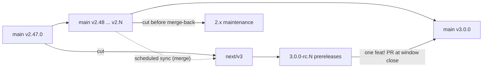

# ADR 006: v3 branching, release, and testing strategy

**Status:** Accepted — long-lived `next/v3` integration branch with `rc` prereleases.
**Date:** 2026-08-09
**Scope:** how v3 work is branched, versioned, and tested. No product behavior of its own.
**Related:** [beyond v2.0.0](../roadmap.md#beyond-v200--autonomous-estate-and-lifecycle-control-plane),
[breaking at v3.0.0](../roadmap.md#breaking-at-v300),
[`docs/v3-development.md`](../v3-development.md) (the working guide),
[`docs/api-v1-migration.md`](../api-v1-migration.md) (sunset 1 Aug 2027)

## Context

v3 is not a normal minor. It is defined by four breaking removals that already have
published deprecation windows — `/api/v1` removal, CRDs promoted to `repave.dev/v1`,
mandatory policy on regulated blueprint families, and blueprint schema v2. The earliest
of those windows closes **1 Aug 2027**, which means v3 work has to be developable for
roughly a year before the `v3.0.0` tag can ship.

Meanwhile `main` is a working product on v2.47.0 shipping v2.x minors continuously, and
release automation on `main` is a hard requirement: a failed Release job after a merge
means versioning is broken (`.cursor/rules/repave-release.mdc`).

So the branching question is really: where does a year of partly-breaking work live
without either freezing the v2 line or letting the v3 line rot?

## Decision

**A long-lived `next/v3` integration branch, cut from `main` at v2.47.0, running the full
required-check suite, versioned as `3.0.0-rc.N` prereleases, synced from `main` on a
schedule, and merged back in one `feat!:` PR when the deprecation windows close.**



### Why not the alternatives

**Pure trunk-based (everything on `main` behind flags).** Attractive, and it is what v2.x
already does well. It fails on the breaking half: `/api/v1` removal and CRD `v1alpha1`
removal are deletions, not flags. You cannot flag-guard a deleted CRD version through a
conversion webhook without shipping both, and the point of the removal is to stop shipping
both. A "one big `feat!:` PR at the end" that carries a year of accumulated deletions is
exactly the unreviewable change this repo's PR discipline exists to prevent.

**Hybrid (features on `main`, short-lived `release/3.0.0` at the end).** This is the better
of the two rejected options and stays the fallback. It was not chosen because the
non-breaking v3 features are not cleanly separable from the breaking ones: mandatory policy
on regulated families is the same code path as the waiver-expiry enforcement that makes it
tolerable, and low-risk auto-merge depends on the mandatory tier. Splitting them across two
branch models means the interesting integration risk is only discovered at the end, which
is the failure mode the long-lived branch is accepting cost to avoid.

The cost being accepted: a year of merge-conflict maintenance against a fast-moving `main`.
That cost is only survivable under the sync and CI rules below, which are load-bearing.

### Sync direction and mechanic

`main` → `next/v3`, **weekly and before every rc**, using a **merge commit**, not a rebase.

The intent is "keep `next/v3` current with `main`", and on a shared published branch the
mechanic for that is a merge. Rebasing `next/v3` rewrites published history and breaks
every clone and open PR targeting it. Rebase stays the right tool one level down, inside
short-lived `feat/v3-*` branches before they merge into `next/v3`.

Nothing flows `next/v3` → `main` except the final merge-back. A fix needed on both lines
lands on `main` first and arrives on `next/v3` through the next sync.

If a weekly sync is ever skipped twice in a row, that is the signal to reconsider this ADR
in favor of the hybrid model rather than to let the branch drift.

### Versioning

`next/v3` gets its own python-semantic-release branch group so conventional commits produce
`3.0.0-rc.N` instead of bumping the v2 line:

```toml
[tool.semantic_release.branches.main]
match = "main"
prerelease = false

[tool.semantic_release.branches.v3]
match = "next/v3"
prerelease = true
prerelease_token = "rc"
```

**Release automation for `next/v3` is a separate workflow**, not a parametrized
`release.yml`. `release.yml` admin-merges `chore/release-*` PRs with an Administrator PAT
and drives hosted EKS deploys off the resulting tag; editing it to be branch-aware puts the
v2 release path one typo away from breaking. A `release-prerelease.yml` that only ever runs
on `next/v3` keeps the v2 path byte-identical, and the duplication is worth it.

Both PSR invocations keep the `psr()` / `env -u GITHUB_OUTPUT` helper — the `commit_sha`
failure mode applies to the prerelease workflow identically.

### Two tag-triggered workflows need guards before the first rc tag

Both `container.yml` and `chart-publish.yml` trigger on `tags: ["v*.*.*"]`, and
`v3.0.0-rc.1` matches that glob.

- **`container.yml` is safe as written.** `docker/metadata-action` with
  `type=semver,pattern={{version}}` and default `latest=auto` does not apply `latest` to a
  prerelease, so rc images publish under `3.0.0-rc.1` without hijacking stable tags.
- **`chart-publish.yml` will fail on every rc tag.** Its guard in
  [`.github/workflows/chart-publish.yml`](../../.github/workflows/chart-publish.yml)
  refuses any tag that is not bare `X.Y.Z`:

```bash
if [[ "${GITHUB_REF}" == refs/tags/v* ]] && ! [[ "${VERSION}" =~ ^[0-9]+\.[0-9]+\.[0-9]+$ ]]; then
  echo "tag '${GITHUB_REF_NAME}' is not a semver vX.Y.Z; refusing publish" >&2
  exit 1
fi
```

  That guard must **skip** prerelease tags rather than fail them. Publishing rc charts is
  optional; dispatching `repave-release` to `opsdevcode/repave-aws-infra` on an rc tag is
  not — hosted infra tracks the stable line and must never be deployed an rc.

### Branch protection and CI

Every workflow that gates PRs uses a bare `pull_request:` trigger with no branch filter, so
PRs into `next/v3` already run all ten required checks with no workflow change. Only
push-triggered jobs need `branches: [main, next/v3]`.

`next/v3` gets its own ruleset (`.github/rulesets/next-v3-branch.json`) with the **same ten
required checks as `main`**, because `main-branch.json` targets `~DEFAULT_BRANCH` and cannot
cover it. `sync-ruleset.yml` must PUT both files.

**No required check is relaxed for `next/v3`, and coverage thresholds stay at 75 (engine)
and 80 (cli).** A long-lived branch that lets CI rot cannot be merged back, which would
strand a year of work. Nightly `operator-e2e` extends to `next/v3` for the same reason.

### Flag discipline

Every v3 behavior lands **default-off behind config**, so `next/v3` is always in a state
that could ship as a v2.x minor. The breaking flips — deletions and default changes — are
held as a small, separately reviewable set of commits at the end rather than spread through
the year. This is what keeps the final merge-back PR readable, and it is also the escape
hatch: if the long-lived branch is abandoned for the hybrid model, default-off features can
be replayed onto `main` individually.

## Testing strategy

The v2 gate suite carries over unchanged and is the floor, not the strategy. v3 adds four
test obligations that v2 does not have, because v3's themes are autonomous actions and
irreversible removals.

**1. Dual-line contract tests.** Until the removal commits land, `next/v3` must prove the
v2 contracts still hold. A new `v3` pytest marker carries behavior that is only valid after
the flip; `make test` runs the v2 shape, `make test-v3` runs the flipped shape. The removal
commit is then mostly a marker deletion, and the diff shows exactly which contracts changed.

**2. Autonomy safety.** Auto-merge decisions must be pure functions of declared risk class,
gate state, waiver state, and error budget — unit-tested against a table of change types
with no I/O in the decision path. Required cases: the kill switch demotes the entire fleet
to review-required in one config change, and a merged low-risk change is revertible by the
documented runbook. Per roadmap done-when #1, this has to be demonstrated in a test
organization, not only in unit tests.

**3. Time-dependent waiver expiry.** Waiver expiry is enforcement, so it needs an injected
clock rather than wall-clock reads, with frozen-time tests for active, expiring, and expired
waivers. An expired waiver fails the gate; it does not warn.

**4. Migration round-trips.** `repave migrate-blueprint` must round-trip all 19
`blueprints/*/conformance.yaml` fixtures, and CRD `v1alpha1` → `v1` conversion needs golden
fixtures both directions while both versions are served.

For conversational generation, the roadmap's done-when #5 (conversational and form paths
produce byte-identical gated output for the same resolved inputs) is the acceptance test.
It requires a deterministic in-package fake model — `StaticModel` / `RecordingModel`
alongside the real client — because CI does no network calls to model providers.

## Consequences

- Two active release lines for roughly a year, with two release workflows to keep working.
- Weekly sync merges are a standing maintenance cost and the leading indicator of whether
  this ADR is holding.
- v2.x users are unaffected: `main` behavior, cadence, and automation do not change.
- A `2.x` maintenance branch is cut from the last v2 tag immediately before the merge-back,
  so v2 can still take security fixes after `main` becomes the v3 line.
- Nothing in this ADR commits to v3 scope. Scope stays governed by
  [beyond v2.0.0](../roadmap.md#beyond-v200--autonomous-estate-and-lifecycle-control-plane)
  and its promotion discipline.
