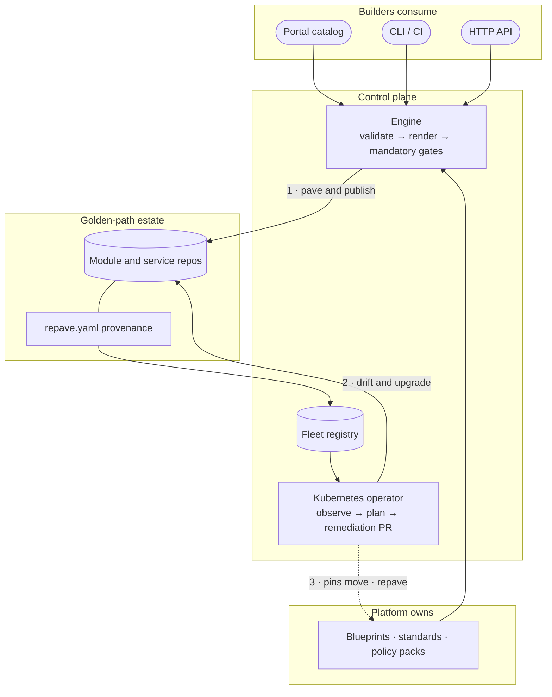
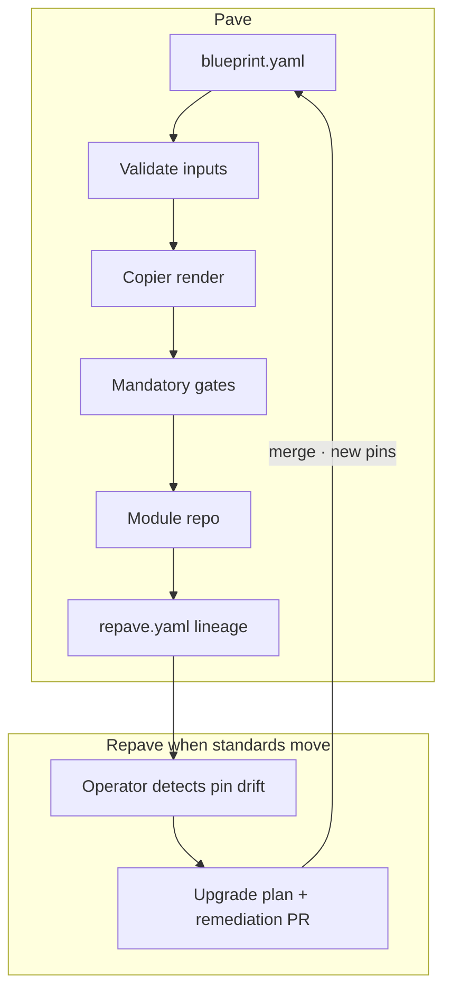
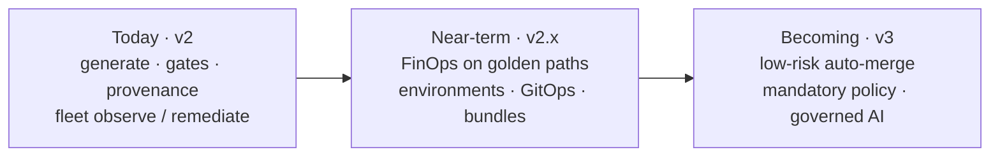

# repave concepts

## Why "repave"

The name is the product thesis. Platform teams pave roads — a blessed way to stand up a
module, a service, a policy pack — and those roads crack as standards move, pins age, and
controls change. repave answers that the immutable-infrastructure way rather than the
patch-in-place way: an artifact is **paved** once from a versioned blueprint and **repaved**
from that blueprint when the standard moves forward. Nobody patches a pothole in a single
repo; the road moves and everything riding on it is re-rendered.

Every other concept below follows from that: blueprints are the road, gates are what keeps
the surface uniform, `repave.yaml` records which road an artifact was paved from, and the
operator repaves the estate when it drifts.

## Internal developer platform

repave is an **internal developer platform** (IDP) for golden-path estates — not a
one-shot generator. Platform owns the corpus; builders consume paved roads; day-2
reconciliation keeps the estate on the current road.

| IDP capability | In repave |
| --- | --- |
| Software catalog / self-service | Portal home catalog, library, [service catalog hub](service-catalog.md) |
| Paved roads / scaffolding | Versioned **blueprints** (golden paths) |
| Governance & policy | Mandatory **gates**, pinned standards and policy packs |
| Service catalog integration | Optional Backstage `catalog-info.yaml` + `repave.dev/*` lineage |
| Maturity / initiatives | Configurable rubric, team pages, `/platform/maturity` |
| Ephemeral sandboxes | GitOps environment vending + workload profiles (ADR 003 / 006) |
| Day-2 / estate control | Fleet registry, `repave update`, Kubernetes **operator** |
| Cost awareness | Infracost gate, cost readers, [FinOps enablement](finops.md) |

| Horizon | Meaning |
| --- | --- |
| **Today (v2)** | Generate, gates, provenance, fleet observe/plan/remediate |
| **Near-term (v2.x)** | FinOps on golden paths; environments, GitOps, composite bundles |
| **Becoming (v3)** | Low-risk auto-merge, mandatory policy, lifecycle control, governed AI |

Front door: [README](../README.md) · Planning: [Roadmap](roadmap.md)

## Golden path

A versioned, opinionated way to produce a compliant artifact. In repave, a golden
path is a **blueprint**: input schema + standard reference + template + gates +
output contract.

## Blueprint

Declarative pack under `blueprints/<name>/` (plus optional extra catalog roots).
The engine reads `blueprint.yaml`, validates inputs, renders the Copier template,
runs gates, and produces output. Artifact types include Terraform, Ansible,
policy, Helm, app-service, and API contracts (`spectral` + `oasdiff`).
See [`blueprint-versioning.md`](blueprint-versioning.md)
for v2 schema freeze, `metadata.version` bump rules, and the
[fork workflow](blueprint-versioning.md#fork-workflow).

## Governance-by-construction

Generated artifacts must pass every configured gate. There is no bypass path.
This is how platform standards scale to users who are not automation experts.

## Housed in one, rendered in many

Standards are authoritative in one git home and rendered read-only in multiple
surfaces (portal docs, enterprise doc pipelines, etc.). Blueprints pin the
standard version they encode.

## Remote publish

When dry-run is disabled and `GITHUB_TOKEN` is set, repave creates the target
GitHub repository (org or user account) if needed and pushes the bootstrapped
module to `main`.

For **platform repository provisioning** (template or selection create, then org team
grants) use the `github-repo-generic` goldpath — see
[GitHub repository goldpath](github-repo-goldpath.md). That path still writes a thin
governed overlay (`repave.yaml`, README) into the new repo.

## Provenance (`repave.yaml`)

Blueprints may declare `spec.output.provenance.file` (typically `repave.yaml`).
The engine writes a `GoldenPathArtifact` document after render with pinned
blueprint and standard versions, generation metadata, and artifact-type-specific
fields (`terraformModule` or `ansibleRole`). Ansible roles also record the pinned
ansible-lint pack (`ansibleLint`), optional **`role_pattern_source`**, and
**`required_collections`** when a catalog pattern needs Galaxy collections. The
`provenance-drift` gate validates
the file against `schemas/golden-path-artifact.schema.json`.

## Ansible standards and policy pack

Ansible golden paths pin a multi-file standard under `standards/ansible/`
(role, collection, playbook-project, security appendix). The production-profile
ansible-lint pack at `policy/ansible-lint/pack/` is copied into generated roles
at render time (parallel to Checkov policies for Terraform modules). Role bodies
come from **`ansible/catalog.json`** patterns when `ansible-role-generic` is used
(see [`ansible/README.md`](../ansible/README.md)).

## Terraform standards pack

Terraform module blueprints pin `standards/terraform-standards/` (engineering
standard + module layout). The monolithic `standards/terraform-module-standard.md`
file is superseded but retained for diff reference. Generated module READMEs cite
the pack version recorded in `repave.yaml`.

## Backstage Software Catalog

Optional or required `catalog-info.yaml` in generated repos registers components in
[Backstage](https://backstage.io/) with Repave lineage annotations (`repave.dev/*`).
See [`docs/backstage.md`](backstage.md) and
[`standards/backstage/catalog-standard.md`](../standards/backstage/catalog-standard.md).

## Portal

The bundled web UI is the primary IDP surface: it maps blueprint inputs to generation and
shows gate results on a shared night-ops shell (home catalog, governance-aware forms,
results dashboard). Layout, components, and acceptance criteria are in
[`docs/portal-design.md`](portal-design.md). Browser-local last-run summary uses
`sessionStorage`; fleet-wide history is available via the JSONL audit sink, portal
`/activity`, and hosted `/runs` when durability SQL is configured
(`repave.config.yaml` `audit` — see [Roadmap v1.30](roadmap-archive.md#v130--audit-log-metrics-and-traces)).

## Self-healing (operator)

The reconciliation **operator** (GA on `main`) watches `GoldenPathRepo` resources, detects pin
drift, plans upgrades, and opens remediation PRs. Inventory works from `spec.localPath` or
`spec.repoURL` (shallow clone — [ADR 001](adr/001-goldenpathrepo-repo-url-inventory.md));
remote remediation uses the inventory workspace clone when a GitHub token is configured.
Development and proof: [`docs/operator-standards.md`](operator-standards.md),
[`docs/operator-local-dev.md`](operator-local-dev.md),
[`docs/operator-ga.md`](operator-ga.md),
[`docs/operator-overview.md`](operator-overview.md). See also
[`docs/roadmap.md`](roadmap-archive.md#v117--reconciliation-operator-alpha) and
[`operator/README.md`](../operator/README.md).

