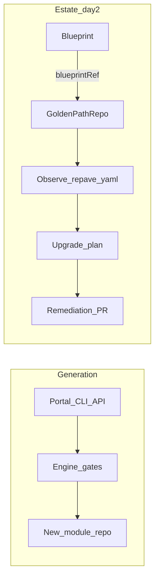

# Operator overview

Kubernetes controller for **estate drift and blueprint upgrades** — the day-2 loop of
the [repave IDP](concepts.md). Generation does not require the operator; use it when many
module repos must stay aligned with catalog pin changes.

Local development: [operator-local-dev.md](operator-local-dev.md) · GA scope:
[operator-ga.md](operator-ga.md) · Package: [`operator/README.md`](../operator/README.md)

## Capabilities

| Capability | CRD / API | Notes |
| --- | --- | --- |
| Inventory | `GoldenPathRepo` | Read `repave.yaml` from `spec.localPath` or shallow-cloned `spec.repoURL`; `status.observedPins` |
| Drift detection | `GoldenPathRepo` status | `OutOfDate` when observed ≠ desired pins |
| Upgrade diff | `status.upgradePlan` | `repave plan-upgrade` contract |
| Remediation PR | `spec.remediation` | `repave apply-upgrade` + GitHub client; dry-run without token |
| Catalog pin watch | `Blueprint` + `spec.blueprintRef` | Reconcile GPRs when Blueprint pins change |

**Inventory modes (GA):**

- **`spec.localPath`** — working tree on the operator pod (kind hostPath, e2e fixtures).
- **`spec.repoURL`** — shallow clone into a temporary workspace, then observe and plan like
  `localPath` ([ADR 001](adr/001-goldenpathrepo-repo-url-inventory.md)). HTTPS remotes use
  `GITHUB_TOKEN`; remote repos re-reconcile on `REPAVE_OPERATOR_REMOTE_RESYNC` (default
  `10m`). Remote remediation reuses the same clone when a write-capable token is set.

## Engine vs operator



```text
Generation:  form/API  →  render  →  gates  →  new module repo

Operator:    GoldenPathRepo  →  observe repave.yaml  →  upgrade plan  →  remediation PR
             Blueprint       →  watch blueprintRef ────────────────┘
```

Package layout: [`operator/`](../operator/)
