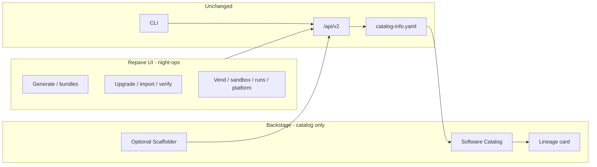

# UI surfaces: workbench and catalog IDP

How the night-ops HTML portal and hosted Backstage share one control plane.
Decision: [ADR 011](adr/011-hosted-backstage-idp.md). Visual language:
[portal-design.md](portal-design.md). Operator Backstage notes:
[backstage.md](backstage.md).

They do **not** clone each other. They hand off.

## Who owns what

| Job | Owner | Why |
| --- | --- | --- |
| Generate, upgrade preview, import, verify, vend, sandbox, runs, fleet, platform | **HTML portal** | Night-ops look; `make serve` stays one process |
| Software catalog, ownership, entity page, `repave.dev/*` lineage | **Backstage** | Catalog IDP; do not rebuild it in Jinja |
| Offline / CI | **CLI** | Unchanged |
| Apply / cluster | **CLI + operator** | Unchanged |

New `/api/v2` features land in HTML **or** CLI only. Do not add workbench pages
under `backstage/plugins/plugin-repave`.

## Handoff

- Generate (HTML or CLI) writes `catalog-info.yaml`.
- Backstage ingests that file and `GET /api/v2/catalog/entities`.
- HTML **Open in catalog** appears when `portal.backstage_url` (or
  `REPAVE_BACKSTAGE_URL`) is set — library, service detail, generate result.
- The lineage card links **Generate in portal** / **Upgrade in portal** using
  `repave.portalBaseUrl` (`REPAVE_PORTAL_BASE_URL`).
- Scaffolder `repave:generate` stays an alternate submit for teams on `/create`.

## Hosted vs laptop

| Context | UI |
| --- | --- |
| `make serve` | HTML workbench. Optional `yarn start` only when working on catalog ingest. |
| Helm + `values-backstage.yaml` | `/` and `/api` → engine (HTML on). `/idp` → Backstage. |
| CLI | No UI. |

`/idp` is the Backstage path prefix so it does not collide with Backstage’s own
`/catalog` route. `portal.html: false` remains an operator opt-out (HTML 410).

## Related

- [ADR 011](adr/011-hosted-backstage-idp.md)
- [backstage.md](backstage.md)
- [portal-design.md](portal-design.md)
